# URAMS — UIU Result & Academic Management System

<p align="center">
  <b>A role-based academic result management system for universities</b><br/>
  Admins manage academic structure, teachers enter marks and attendance, students view results/transcripts, and parents monitor academic progress.
</p>

<p align="center">
  
  
  
  
</p>

---

## Table of Contents

- [Project Overview](#project-overview)
- [Core Objectives](#core-objectives)
- [Key Features](#key-features)
- [User Roles](#user-roles)
- [Technology Stack](#technology-stack)
- [System Architecture](#system-architecture)
- [C4 Architecture Diagrams](#c4-architecture-diagrams)
- [Project Workflow](#project-workflow)
- [Database Design](#database-design)
- [Entity Relationship Diagram](#entity-relationship-diagram)
- [UML Diagrams](#uml-diagrams)
- [Dependency Graphs](#dependency-graphs)
- [Code Visualization](#code-visualization)
- [Core Backend Endpoints](#core-backend-endpoints)
- [Installation Guide](#installation-guide)
- [Default Credentials](#default-credentials)
- [Common SQL Queries](#common-sql-queries)
- [Testing Checklist](#testing-checklist)
- [Troubleshooting](#troubleshooting)
- [Future Improvements](#future-improvements)
- [Security Notes](#security-notes)
- [License](#license)

---

## Project Overview

**URAMS** stands for **University Result and Academic Management System**.

It is a PHP and MySQL based academic management platform designed to manage the complete result-processing workflow of a university. The system supports academic setup, teacher assignment, student enrollment, prerequisite checking, marks entry, attendance, result submission, admin approval, transcript generation, and parent/student result monitoring.

---

## Core Objectives

- Centralize academic result processing.
- Reduce manual result calculation errors.
- Allow teachers to enter marks component-wise.
- Support course, section, trimester, and curriculum-based academic setup.
- Ensure only approved results are visible to students and parents.
- Maintain transparency using audit logs and approval workflow.
- Provide transcript and GPA/CGPA generation.

---

## Key Features

### Admin Module

- Admin dashboard with academic overview.
- Teacher management.
- Student management.
- Academic setup.
- Course section creation.
- Teacher assignment.
- Student enrollment.
- Prerequisite checking.
- Result approval/rejection.
- Grade rules management.
- Audit log and notifications.

### Teacher Module

- Teacher dashboard.
- Assigned section view.
- Marks entry and update.
- Assessment component configuration.
- Grace marks processing.
- CT average calculation.
- Attendance management.
- Result submission.
- PDF/report generation.
- Excel/CSV marks sheet download and upload.

### Student Module

- Student dashboard.
- Approved result view.
- Trimester-wise result history.
- GPA/CGPA view.
- Transcript generation.
- Attendance summary.
- Student profile.

### Parent Module

- Parent dashboard.
- Linked child academic result view.
- Read-only child performance analytics.
- Academic progress monitoring.

---

## User Roles

| Role | Main Responsibility |
|---|---|
| Admin | Controls academic setup, users, approvals, rules, and audit logs |
| Teacher | Manages marks, attendance, and result submission |
| Student | Views approved result, GPA, CGPA, and transcript |
| Parent | Views linked child result and academic progress |

---

## Technology Stack

| Layer | Technology |
|---|---|
| Frontend | HTML, CSS, JavaScript |
| Backend | PHP |
| Database | MySQL / MariaDB |
| Local Server | XAMPP |
| UI Assets | Custom CSS, icons |
| Reporting | Browser print/PDF, PHP-generated reports |
| Version Control | Git and GitHub |

---

## System Architecture

URAMS follows a traditional **client-server web architecture**.

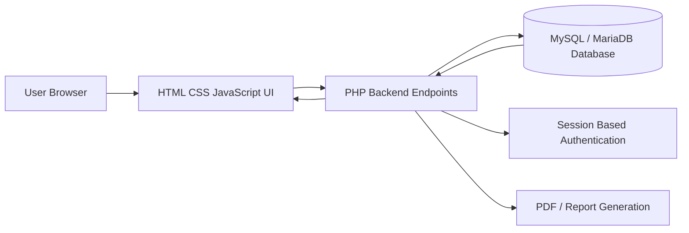

### Architecture Explanation

1. User interacts with the browser interface.
2. JavaScript sends requests to PHP backend files.
3. PHP validates session, role, and input.
4. PHP performs database operations using MySQL/MariaDB.
5. Backend returns JSON response or renders PHP pages.
6. Frontend updates dashboard, tables, forms, and charts.

---

## C4 Architecture Diagrams

### C4 Level 1 — System Context Diagram

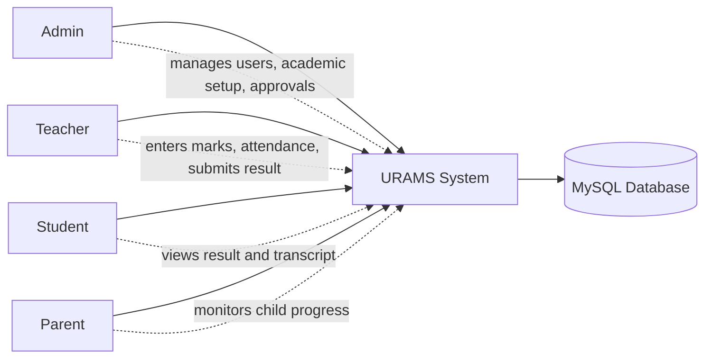

### C4 Level 2 — Container Diagram

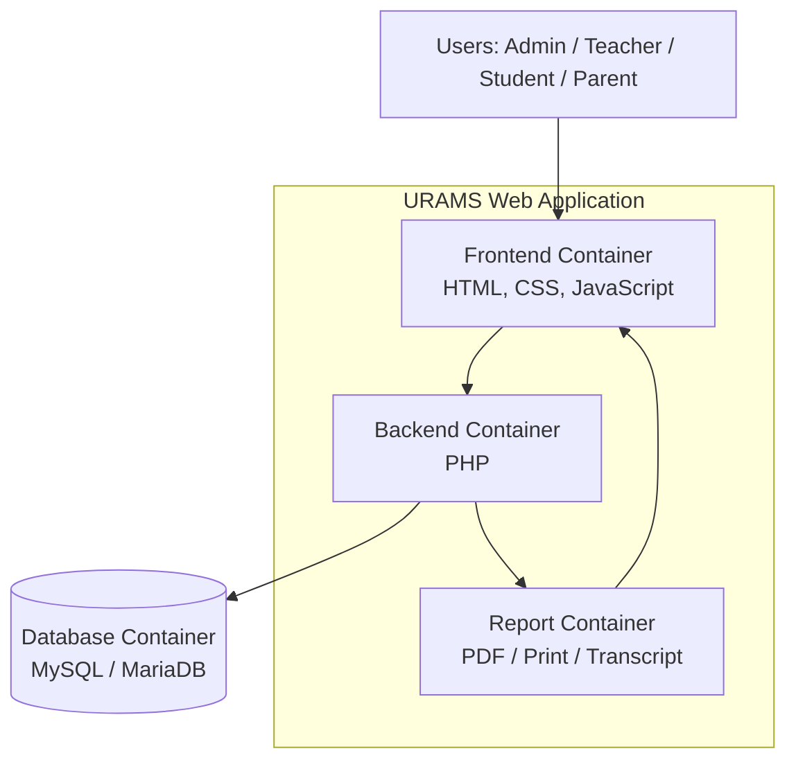

### C4 Level 3 — Component Diagram

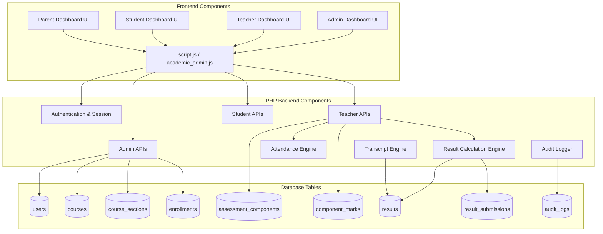

---

## Project Workflow

### Full Academic Result Workflow

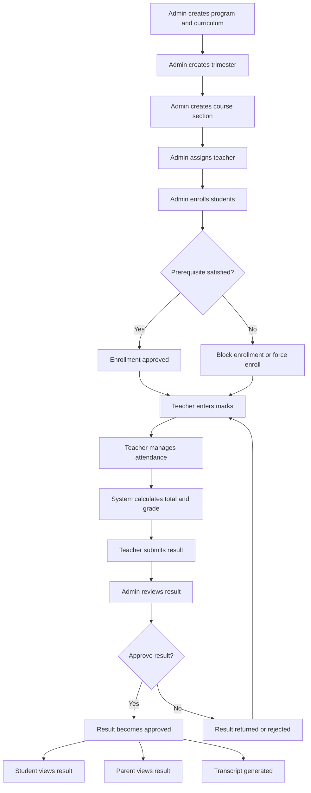

### Login and Role Routing Flow

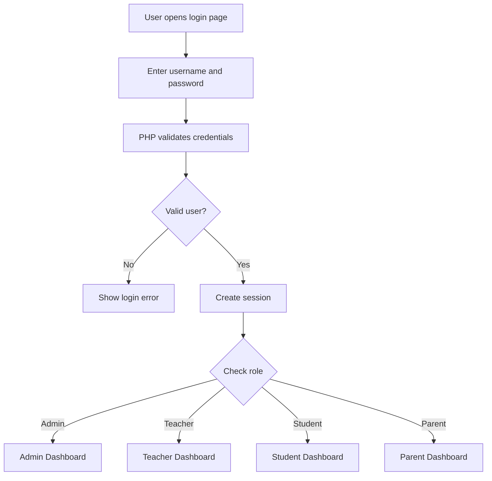

---

## Database Design

### Main Database Tables

| Table | Purpose |
|---|---|
| `users` | Stores admin, teacher, student, and parent accounts |
| `programs` | Stores academic programs such as BBA, CSE, EEE, Pharmacy |
| `curriculum_versions` | Stores curriculum versions for programs |
| `courses` | Stores course catalog |
| `curriculum_courses` | Maps courses with curriculum versions |
| `course_prerequisites` | Stores prerequisite course rules |
| `trimesters` | Stores academic trimester/session information |
| `course_sections` | Stores course sections and teacher assignment |
| `enrollments` | Stores student enrollment in sections |
| `assessment_components` | Stores marks components such as CT, Assignment, Mid, Final |
| `component_marks` | Stores component-wise student marks |
| `attendance_records` | Stores attendance records |
| `results` | Stores calculated final result per enrollment |
| `student_section_results` | Stores section-wise finalized result |
| `result_submissions` | Stores teacher submission and admin approval status |
| `grade_rules` | Stores grading scale |
| `audit_logs` | Stores important system activities |
| `notifications` | Stores system notifications |

---

## Entity Relationship Diagram

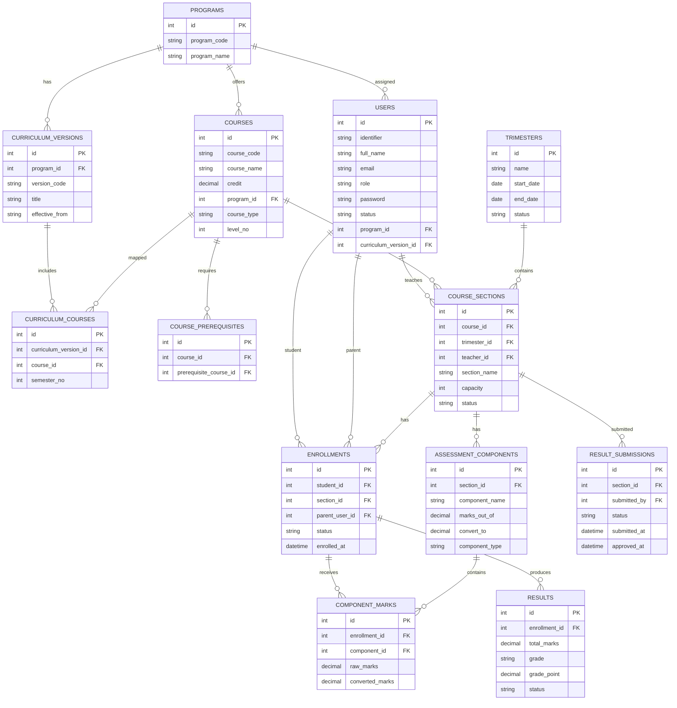

---

## UML Diagrams

### UML Use Case Diagram

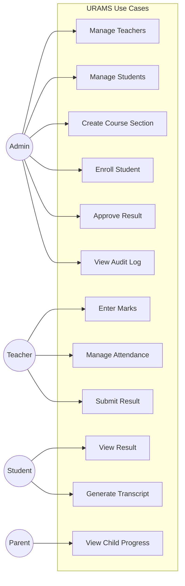

### UML Class Diagram

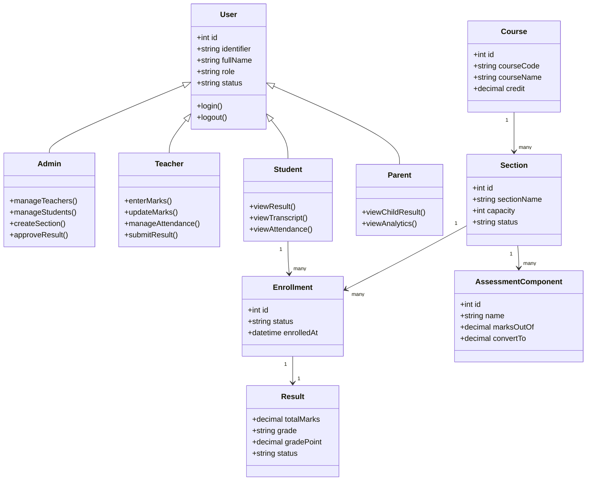

### Sequence Diagram — Marks Entry and Result Approval

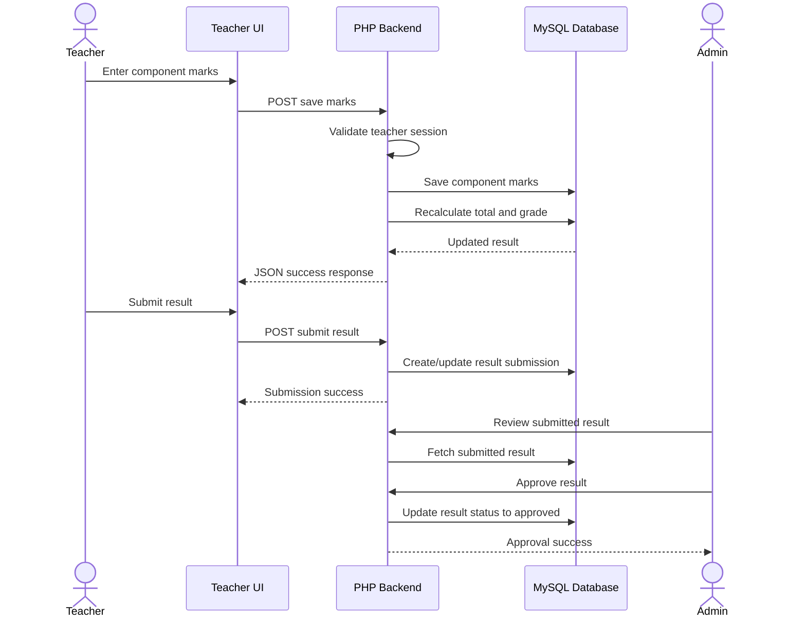

---

## Dependency Graphs

### Application Dependency Graph

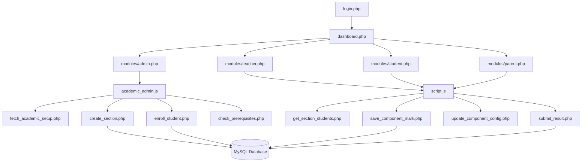

### Backend Helper Dependency Graph

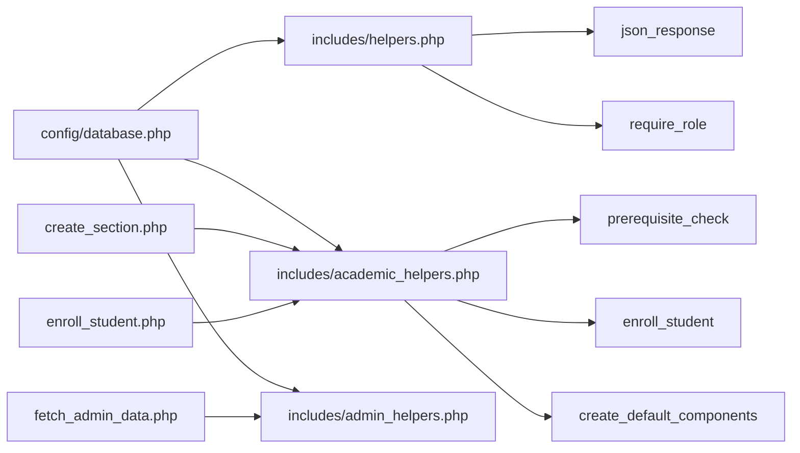

---

## Code Visualization

### Recommended Project Structure

```text
urams_final/
│
├── config/
│   └── database.php
│
├── database/
│   ├── 000_IMPORT_THIS_FULL_FINAL_DEMO.sql
│   ├── 007_academic_setup.sql
│   └── other_migrations.sql
│
├── includes/
│   ├── header.php
│   ├── footer.php
│   ├── helpers.php
│   ├── academic_helpers.php
│   └── admin_helpers.php
│
├── modules/
│   ├── admin.php
│   ├── teacher.php
│   ├── student.php
│   └── parent.php
│
├── public/
│   └── assets/
│       ├── css/
│       │   └── style.css
│       └── js/
│           ├── script.js
│           └── academic_admin.js
│
├── uploads/
│   └── .gitkeep
│
├── docs/
│   └── index.html
│
├── login.php
├── logout.php
├── dashboard.php
├── create_section.php
├── enroll_student.php
├── check_prerequisites.php
├── fetch_academic_setup.php
├── get_section_students.php
├── save_component_mark.php
├── update_component_config.php
├── submit_result.php
├── approve_result.php
├── README.md
└── .gitignore
```

### Code Execution Flow

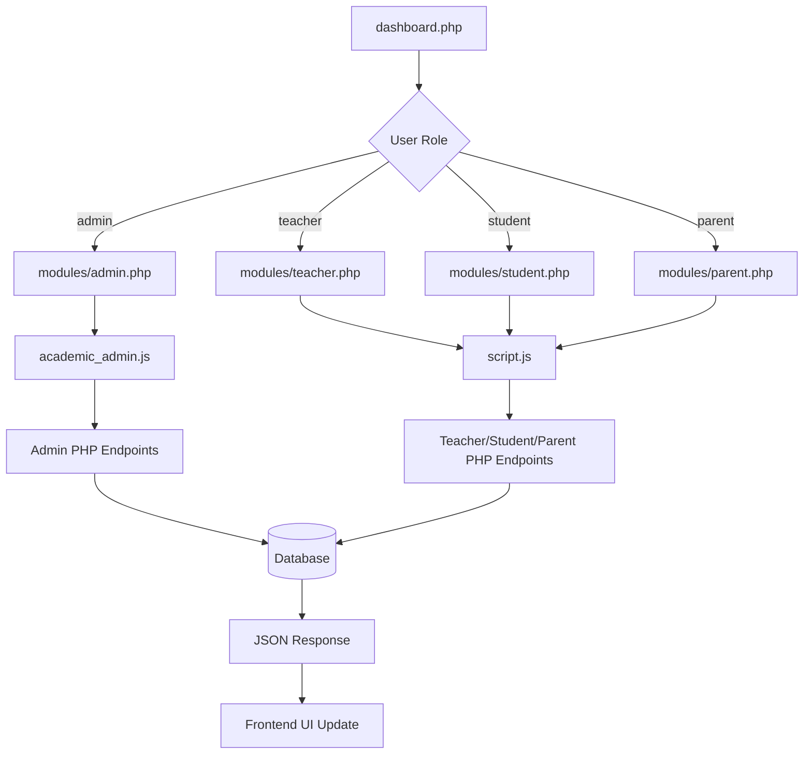

---

## Core Backend Endpoints

| Endpoint | Method | Purpose |
|---|---:|---|
| `login.php` | POST | Authenticates user |
| `logout.php` | GET | Destroys user session |
| `fetch_admin_data.php` | GET | Loads admin dashboard data |
| `fetch_academic_setup.php` | GET | Loads programs, curricula, courses, sections |
| `create_section.php` | POST | Creates course section and default components |
| `check_prerequisites.php` | POST | Checks student prerequisites |
| `enroll_student.php` | POST | Enrolls student into section |
| `get_section_students.php` | GET | Loads students for selected section |
| `save_component_mark.php` | POST | Saves component-wise marks |
| `update_component_config.php` | POST | Updates component marks-out-of and convert-to |
| `recalculate_section.php` | POST | Recalculates result for a section |
| `grade_process.php` | POST | Processes grades |
| `submit_result.php` | POST | Teacher submits result |
| `approve_result.php` | POST | Admin approves or rejects result |
| `download_marks_excel.php` | GET | Downloads marks sheet |
| `upload_marks_excel.php` | POST | Uploads marks sheet |

---

## Installation Guide

### Requirements

- XAMPP installed.
- PHP 8.x recommended.
- MySQL/MariaDB.
- Web browser.
- Git installed.

### Step 1 — Clone Repository

```bash
git clone https://github.com/your-username/urams-university-result-management-system.git
```

### Step 2 — Move Project to XAMPP

Move or copy the project folder to:

```text
C:\xampp\htdocs\urams_final
```

### Step 3 — Start Server

Open XAMPP Control Panel and start:

```text
Apache
MySQL
```

### Step 4 — Create Database

Open phpMyAdmin:

```text
http://localhost/phpmyadmin
```

Create a database:

```sql
CREATE DATABASE urams_db;
```

### Step 5 — Import SQL

Import the SQL files from the `database/` folder.

Recommended order:

```text
1. Full final demo SQL
2. Academic setup SQL
3. Any later migration SQL files
```

### Step 6 — Configure Database

Open:

```text
config/database.php
```

Check database credentials:

```php
$host = "localhost";
$dbname = "urams_db";
$username = "root";
$password = "";
```

### Step 7 — Run Project

Open browser:

```text
http://localhost/urams_final/login.php
```

---

## Default Credentials

> Change these credentials before using the system in production.

| Role | Username / ID | Password |
|---|---|---|
| Admin | `admin001` | `password123` |
| Teacher | `MRI` | `password123` |
| Teacher | `TT1` | `password123` |
| Student | `0242220005` | `password123` |
| Test Student | `0242220099` | `password123` |
| Parent | `PARENT0242220005` | `password123` |
| Test Parent | `PARENT0242220099` | `password123` |

---

## Common SQL Queries

### Select Database

```sql
USE urams_db;
```

### Show All Tables

```sql
SHOW TABLES;
```

### View Users

```sql
SELECT id, identifier, full_name, role, email, status
FROM users
ORDER BY role, id;
```

### View Course Sections

```sql
SELECT 
    cs.id,
    c.course_code,
    c.course_name,
    cs.section_name,
    tr.name AS trimester,
    t.identifier AS teacher_initial,
    t.full_name AS teacher_name,
    cs.status
FROM course_sections cs
JOIN courses c ON c.id = cs.course_id
JOIN trimesters tr ON tr.id = cs.trimester_id
LEFT JOIN users t ON t.id = cs.teacher_id
ORDER BY tr.start_date DESC, c.course_code, cs.section_name;
```

### View Enrolled Students

```sql
SELECT 
    e.id AS enrollment_id,
    s.identifier AS student_id,
    s.full_name AS student_name,
    c.course_code,
    cs.section_name
FROM enrollments e
JOIN users s ON s.id = e.student_id
JOIN course_sections cs ON cs.id = e.section_id
JOIN courses c ON c.id = cs.course_id
ORDER BY e.id DESC;
```

### View Approved Transcript Data

```sql
SET @student_uiu_id = '0242220005';

SELECT
    s.identifier AS student_id,
    s.full_name AS student_name,
    tr.name AS trimester,
    c.course_code,
    c.course_name,
    c.credit,
    cs.section_name,
    COALESCE(ssr.total_marks, r.total_marks) AS total_marks,
    COALESCE(ssr.grade, r.grade) AS grade,
    COALESCE(ssr.grade_point, r.grade_point) AS grade_point
FROM enrollments e
JOIN users s ON s.id = e.student_id
JOIN course_sections cs ON cs.id = e.section_id
JOIN courses c ON c.id = cs.course_id
JOIN trimesters tr ON tr.id = cs.trimester_id
JOIN results r ON r.enrollment_id = e.id AND r.status = 'approved'
LEFT JOIN student_section_results ssr ON ssr.enrollment_id = e.id
WHERE s.identifier = @student_uiu_id
ORDER BY tr.start_date DESC, c.course_code ASC;
```

### Calculate CGPA

```sql
SET @student_uiu_id = '0242220005';

SELECT
    s.identifier AS student_id,
    s.full_name AS student_name,
    SUM(c.credit) AS credits_completed,
    ROUND(
        SUM(c.credit * COALESCE(ssr.grade_point, r.grade_point)) / SUM(c.credit),
        2
    ) AS cgpa
FROM enrollments e
JOIN users s ON s.id = e.student_id
JOIN course_sections cs ON cs.id = e.section_id
JOIN courses c ON c.id = cs.course_id
JOIN results r ON r.enrollment_id = e.id AND r.status = 'approved'
LEFT JOIN student_section_results ssr ON ssr.enrollment_id = e.id
WHERE s.identifier = @student_uiu_id;
```

---

## Testing Checklist

### Admin Testing

- [ ] Admin can login.
- [ ] Admin can add teacher.
- [ ] Admin can add student.
- [ ] Admin can create course section.
- [ ] Admin can assign teacher to section.
- [ ] Admin can enroll student.
- [ ] Admin can approve result.
- [ ] Admin can reject result.
- [ ] Admin can view audit logs.

### Teacher Testing

- [ ] Teacher can login.
- [ ] Teacher can view assigned sections.
- [ ] Teacher can select trimester, course, and section.
- [ ] Teacher can enter marks.
- [ ] Teacher can update component configuration.
- [ ] Teacher can apply grace marks.
- [ ] Teacher can manage attendance.
- [ ] Teacher can submit result.
- [ ] Teacher cannot edit approved section marks.

### Student Testing

- [ ] Student can login.
- [ ] Student can view approved result.
- [ ] Student cannot view unapproved result.
- [ ] Student can view transcript.
- [ ] Student can view GPA/CGPA.

### Parent Testing

- [ ] Parent can login.
- [ ] Parent can view linked child result.
- [ ] Parent cannot edit data.
- [ ] Parent can view analytics.

---

## Troubleshooting

### Error: No database selected

Run:

```sql
USE urams_db;
```

Then run the query again.

### Error: Invalid JSON response

Possible reasons:

- PHP endpoint returned HTML/warning instead of JSON.
- Session role is invalid.
- SQL error occurred.
- File path is wrong.
- User logged into multiple roles in the same browser session.

Fix:

```text
Logout from all roles.
Login with only one role.
Open F12 → Network → Response.
Check actual backend error.
```

### Error: 403 Forbidden

Reason:

```text
The current logged-in user does not have permission for that endpoint.
```

Fix:

```text
Logout first, then login with the correct role.
```

### Teacher page shows 0 students

Possible reasons:

- Student is not enrolled in that section.
- Wrong trimester/course/section selected.
- Teacher is not assigned to that section.
- Student enrollment status is inactive.

Fix:

```text
Admin → Academic Setup → Enroll Student
Teacher → Select Trimester/Course/Section → Apply
```

### Transcript is blank

Possible reasons:

- Result is not approved.
- Section is not approved.
- Student has no enrollment.
- Grade process not completed.

Fix:

```text
Teacher submits result.
Admin approves result.
Student refreshes transcript page.
```

---

## Future Improvements

- RESTful API structure.
- Laravel migration in future version.
- Export transcript as official PDF.
- Email notification system.
- Role-based permission middleware.
- Better charting library.
- Bulk student import.
- Bulk teacher import.
- Advanced analytics dashboard.
- Secure password reset system.
- Production-ready deployment support.

---

## Security Notes

This project is developed for academic demonstration. Before production use:

- Hash passwords securely using `password_hash()`.
- Use HTTPS.
- Validate all inputs.
- Use prepared statements for every SQL query.
- Restrict direct file access.
- Implement CSRF protection.
- Remove demo credentials.
- Protect upload directories.
- Separate `.env` configuration from source code.

---

## License

This project is prepared for academic and educational purposes.

---

## Author

**URAMS Project Team**  
University Result and Academic Management System
